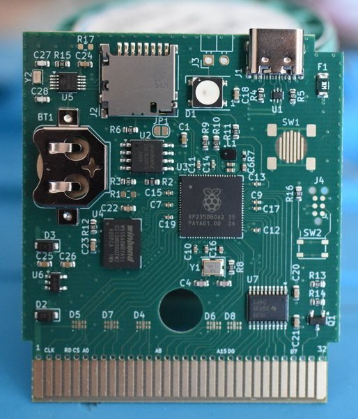

<p align="center">
  
</p>

# Savepoint Signer

*Your old handheld has one more side quest.*

Dust off a **Game Boy Color, Game Boy Advance, or GBA SP**. Add a Croco
Cartridge V2.1 **RP2350 PCB** and a microSD card, and you have the makings of a
stealth Bitcoin signer inside a game you can actually play. A fitted plastic
cartridge shell is planned; today's prototype uses the bare PCB.

For the cartridge hardware, you can [buy an RP2350B Croco Cartridge on
Tindie](https://www.tindie.com/products/zeraphim/rp2350b-based-gameboy-cartridge/)
or [build one from the open hardware
design](https://github.com/shilga/rp-gameboy-cartridge-hw). The Tindie link is
non-affiliate; Savepoint Signer is not affiliated with the seller.

Savepoint Signer hides its signing interface in a modified Pokémon Crystal.
Walk through New Bark Town, talk to the sign twice, and the easter egg opens:
recover a test seed, inspect public keys, review a PSBT, and approve a
signature. Lock the session and go straight back to the adventure. The
cartridge still boots to its ordinary SD game selector and saves games normally.
The Game Boy handles the controls and screen; the RP2350 handles key derivation,
transaction review, and signing. It is a small, inspectable cypherpunk project
for the handheld you already own.

> **Experimental — do not use real funds.** Do not enter a seed that controls
> valuable bitcoin or approve a real transaction with this prototype. It has
> not had an independent security audit. The cartridge has no secure boot or
> tamper-resistant trusted display, and software memory wiping is best-effort.
> Use only disposable test seeds and testnet coins. Mainnet support exists for
> compatibility and testing; it is not a claim that mainnet use is safe.



The supported integration is a native Crystal ROM interface plus the RP2350
signer backend. There is one source patch, one ROM builder, and one transport.

## A look inside

These are direct 160 × 144 emulator captures from the automated regression.
They use the public BIP39 test mnemonic, synthetic PSBT data and no real funds.
The room is still a game; the signer is the easter egg behind the New Bark sign.

[Watch the 18-second New Bark Town walkthrough](docs/media/new-bark-to-signer.mp4):
walk to the sign, interact twice, and open the signer menu. This is an
emulator recording using the project's test backend; no seed is entered.

| The sign in New Bark Town | The hidden signer menu | Entering a test seed |
| :---: | :---: | :---: |
|  |  |  |

| Verify identity | Pick a PSBT | Review an output |
| :---: | :---: | :---: |
|  |  |  |

The [screenshot gallery](docs/screenshots/README.md) also shows key derivation,
QR account export, fee and approval pages, and the return to Crystal.

## Build and install

You need Rust with `thumbv8m.main-none-eabihf`, GBDK, an ARM C compiler for
libsecp256k1, and picotool. The tested local Rust compiler is
`1.98.0-nightly (cb46fbb8c 2026-06-08)`. Dependency versions are locked.

```sh
rustup target add thumbv8m.main-none-eabihf
GBDK_PATH=/path/to/gbdk sh scripts/build-release.sh
picotool load -f -u -v -x -t elf target/thumbv8m.main-none-eabihf/release/rp2350-gameboy-cartridge
```

Crystal support is enabled by default. `--no-default-features` builds the plain
flashcart. The wrapper also prevents duplicate linker flags in nested checkouts.
For macOS LLVM, set `CC_thumbv8m.main_none_eabihf` and
`AR_thumbv8m.main_none_eabihf` with `env`; see [testing](docs/testing.md).

Build the game using the [Crystal instructions](integrations/pokecrystal/README.md).
Copy `pokecrystal.gbc` and your PSBT files to the FAT32 SD root. Keep the ROM's
filename stable so it keeps using the same save file. The normal selector
launches Crystal just like another game.

## Use the signer

1. Talk to the New Bark town sign at `(8,8)`, dismiss its original text, then
   interact again to open SIGNER.
2. Choose **Recover seed**, select mainnet/testnet and 12/24 words. The D-pad
   moves the keyboard; A types; SELECT switches to the candidate list; A picks
   a word. On PASSPHRASE, START starts recovery.
3. Compare the fingerprint/address with your coordinator and confirm. Receive
   addresses, account export by QR, and SD PSBT selection are then available.
4. Review the transaction before approving signing. Export uses the first free
   `SIGNED.PSB`, `SIGNED1.PSB` … `SIGNED9.PSB`; existing files are not overwritten.
5. **Lock and return**, or B in the main menu, clears the seed session and
   returns to the game. The QR screen also uses B to return to the signer menu.

The current policy supports one native-SegWit input and at most two outputs,
with bounded PSBT sizes and explicit approval. The review screen cannot make a
compromised firmware or game ROM trustworthy. Use public test vectors only.
See [architecture and limits](docs/architecture.md) and
[verification evidence](docs/testing.md).

## Ordinary games and saves

Put `.gb`/`.gbc` files in the FAT32 SD root. Choose a game and press A.
Games use their own normal SAVE menu; no hardware save button is required.
The firmware waits for a 500 ms SRAM-disabled quiet period, skips unchanged
images, then writes `<ROM>.TMP` followed by `<ROM>.SAV`. Startup restores the
save before releasing Game Boy reset, with a complete `.TMP` as recovery when
`.SAV` is truncated. Sudden power loss before the SD write finishes can still
lose the latest save.

The LED is blue during a save write, green on success, and red on failure.
Configure the battery-backed RTC from the game selector's SELECT menu. UTC
keeps timestamps compatible with desktop emulators. RTC setup is unnecessary
for games without a timer.

## Validate and publish

[Testing](docs/testing.md) covers host policy/SD tests and the active ROM's
recovery, return-to-town, SAVE and fresh CONTINUE regression.
The [publishing checklist](docs/publishing.md) covers signed commits, physical
smoke tests and the draft release gate.

```sh
GBDK_PATH=/path/to/gbdk sh scripts/package-release.sh
```

The release archive contains the firmware, checksums, documentation, and the
pinned Crystal source patch/builder. The complete game ROM is built locally;
it is not included in Git or the release archive. Tagged releases are created
as drafts. No publish or push is performed by the local scripts.

## Roots and credits

Savepoint Signer depends on the
[Croco Cartridge V2 hardware](https://github.com/shilga/rp-gameboy-cartridge-hw/tree/master/KiCad/V2/GameboyCartridgeV2.1)
and builds on Sebastian Quilitz's
[Croco Cartridge firmware](https://github.com/shilga/rp2350-gameboy-cartridge-firmware).
The game integration is a patch against the
[pret/pokecrystal disassembly](https://github.com/pret/pokecrystal), pinned to a
specific upstream commit. Thanks to those projects and their contributors.
This is an independent fan experiment, unaffiliated with them or with Nintendo,
Game Freak, Creatures, or The Pokémon Company. The complete game ROM is neither
tracked nor distributed here; users build it from the upstream disassembly and
this project's patch. See [build instructions](integrations/pokecrystal/README.md).

Firmware license: [GPL-3.0-or-later](LICENSE); third-party components retain
their own licenses. The [architecture](docs/architecture.md) and
[test evidence](docs/testing.md) describe what has and has not been verified.
