# Savepoint Signer in the game

These captures come directly from the 160 × 144 pixel PyBoy regression of the
patched Crystal ROM. The emulator talks to the production Rust seed state
machine through a test bridge. It uses the public 12-word `abandon … about`
BIP39 vector and a synthetic PSBT; no real seed or funds are pictured. The
file listing is supplied by the test bridge, so these images do not prove
physical SD-card operation.

| Step | Screenshot | What happens |
| --- | --- | --- |
| Enter | 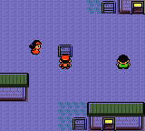 | Talk to the New Bark Town sign twice. |
| Open | 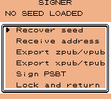 | Choose recovery, address, export, signing or return. |
| Recover | 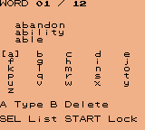 | Select BIP39 words using D-pad, A and SELECT. |
| Derive | 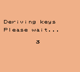 | The RP2350 derives keys after the passphrase is submitted. |
| Verify | 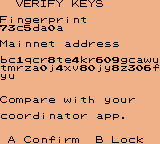 | Compare the fingerprint and address with a separate coordinator. |
| Export |  | Display an account export QR, then B to return. |
| Select | 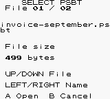 | Pick a PSBT from the SD root on hardware. |
| Review | 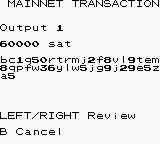 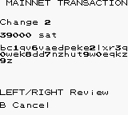 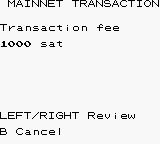 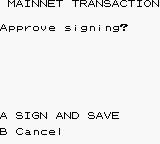 | Inspect each output and the fee before approval. |
| Return | 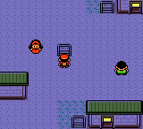 | Lock the seed session and continue playing. |

These screenshots show a working emulator path, not a security certification.
**Do not recover a seed holding real funds or sign a real transaction with
this experimental build.** See [verification limits](../testing.md) and the
[README warning](../../README.md).
